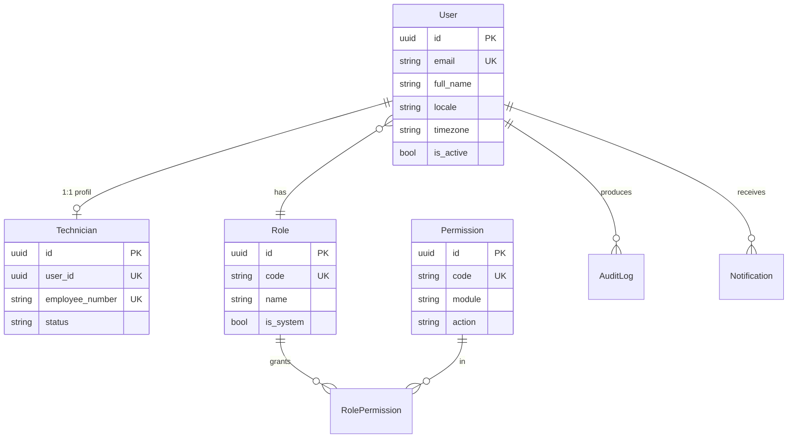
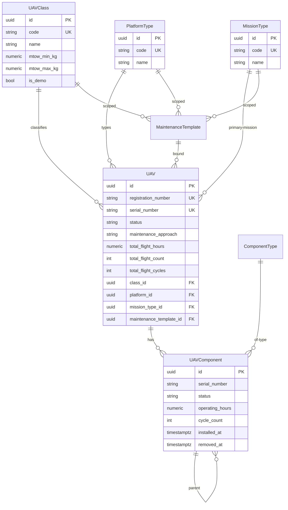
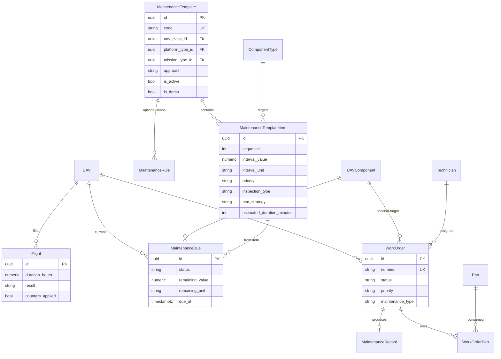
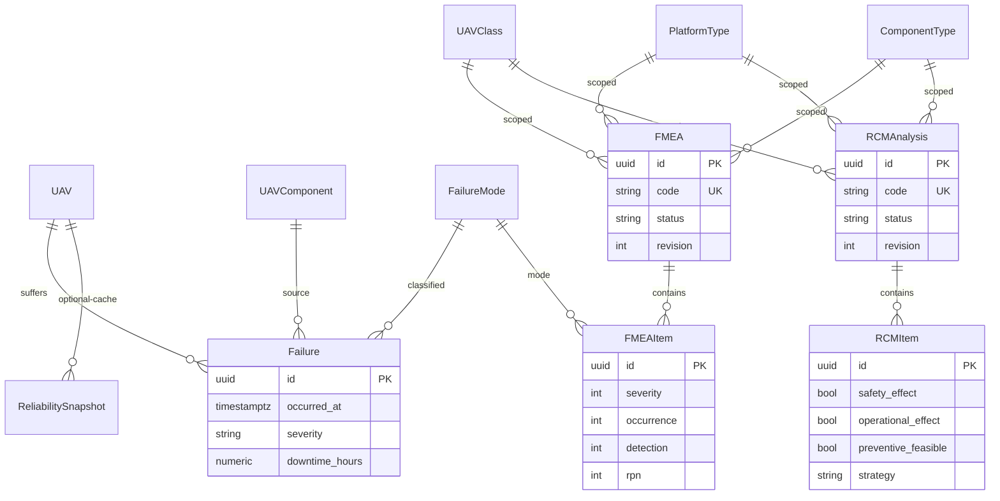

# 03 — ER Modeli

Tüm iş varlıkları UUID PK kullanır. `created_at`, `updated_at`, `created_by`, `updated_by` ortak iz alanlarıdır. Kritik tablolarda `is_deleted` / `deleted_at` vardır.

## 1. Çekirdek ilişki (özet)

```text
UAVClass ──┐
PlatformType ──┼── MaintenanceTemplate ── MaintenanceTemplateItem ── ComponentType
MissionType ──┘                                      │
                                                     │
User ── Technician                                   │
  │                                                  ▼
  └── Role ── RolePermission ── Permission     UAV ── UAVComponent
                                                     │
Flight ──────────────────────────────────────────────┤
Failure ─────────────────────────────────────────────┤
MaintenanceRecord / WorkOrder ───────────────────────┤
Document / CostRecord ───────────────────────────────┘

FMEA ── FMEAItem     (kapsam: class + platform + component_type [+ mission])
RCMAnalysis ── RCMItem
```

## 2. Kimlik ve yetki



Sistem rolleri silinmez: `ADMIN`, `MAINTENANCE_MANAGER`, `TECHNICIAN`, `OPERATOR`, `VIEWER`.

## 3. Taksonomi ve filo



`UAV.status`: `READY | MAINTENANCE | GROUNDED | RETIRED`  
`UAV.maintenance_approach`: `STANDARD | CLASS_SPECIFIC`

Kurulu komponent ağacı UAV köküne bağlıdır. Aynı anda `removed_at IS NULL` olan seri numarası tekildir.

## 4. Bakım şablonu, kural, uçuş, iş emri



`MaintenanceTemplate` için benzersiz aktif üçlü:

```text
UNIQUE (uav_class_id, platform_type_id, mission_type_id, approach) WHERE is_deleted = false AND is_active = true
```

## 5. Arıza, FMEA, RCM, güvenilirlik



Aynı komponent türü farklı platformda ayrı FMEA/RCM kaydı olabilir. Kimlik: `(class, platform, component_type, [mission], revision)`.

## 6. Parça, doküman, maliyet, ayar

```mermaid
erDiagram
    Part ||--o{ PartCompatibility : applies
    UAVClass ||--o{ PartCompatibility : class
    PlatformType ||--o{ PartCompatibility : platform
    ComponentType ||--o{ PartCompatibility : component
    UAV ||--o{ Document : attached
    UAVComponent ||--o{ Document : attached
    WorkOrder ||--o{ Document : attached
    MaintenanceTemplate ||--o{ Document : attached
    WorkOrder ||--o{ CostRecord : costs
    SystemSetting {
        uuid id PK
        string key UK
        jsonb value
    }
```

## 7. Bütünlük kuralları

1. UAV oluşturulunca `CLASS_SPECIFIC` ise tam üçlü şablon aranır; yoksa kayıt reddedilir veya şablonsuz bırakılır (uyarı). `STANDARD` ise `approach=STANDARD` şablonu bağlanır.
2. Uçuş `result=COMPLETED` ve `counters_applied=false` iken sayaçlar bir transaction içinde artar; `counters_applied=true` olur. İkinci kez artmaz.
3. Sökülen komponent (`removed_at` dolu) yeni uçuştan saat almaz.
4. İş emri `COMPLETED` olunca `MaintenanceRecord` zorunludur.
5. FMEA kaleminde RPN uygulama katmanında `S × O × D` ile hesaplanır; istemci değeri kaynak değildir.
6. Silinen sınıf/platform/görev, bağlı UAV veya şablon varken hard-delete edilemez.
